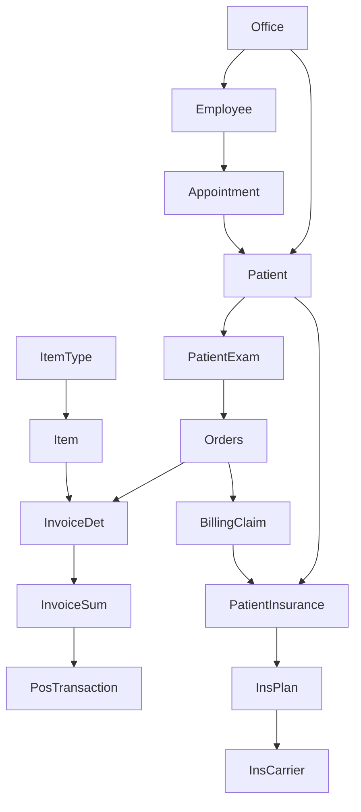

# Eyecare Analytics Data Dictionary V1.1

## Overview
This comprehensive data dictionary documents the complete structure, relationships, and business rules for the eyecare analytics platform built on Snowflake. The data model supports a full-service eyecare practice management system including patient care, product sales, insurance processing, and financial analytics.

**Last Updated:** 2025-08-08  
**Version:** 1.1  
**Environment:** Snowflake - EYECARE_ANALYTICS Database  
**Data Model:** Complete foreign key relationships validated from source system

---

## Table of Contents
1. [Business Entity Overview](#business-entity-overview)
2. [Core Revenue Cycle Flow](#core-revenue-cycle-flow)
3. [Core Transaction Tables](#core-transaction-tables)
4. [Product & Inventory Tables](#product--inventory-tables)
5. [Customer & Patient Tables](#customer--patient-tables)
6. [Billing & Financial Tables](#billing--financial-tables)
7. [Operational Tables](#operational-tables)
8. [Specialized Product Tables](#specialized-product-tables)
9. [Promotion & Discount Tables](#promotion--discount-tables)
10. [Foreign Key Relationships](#foreign-key-relationships)
11. [Entity Relationship Diagram](#entity-relationship-diagram)
12. [Business Rules](#business-rules)
13. [Data Quality Notes](#data-quality-notes)

---

## Business Entity Overview

### 🏢 **Core Business Entities**
The eyecare data model is built around these central entities:

| Entity | Role | Key Relationships | Business Purpose |
|--------|------|------------------|------------------|
| **Patient** | Central Hub | 4+ relationships | Customer management, clinical records |
| **Office** | Location Hub | 3+ relationships | Multi-location operations, staff assignments |
| **Item/ItemType** | Product Hub | Product catalog | Inventory, sales, pricing |
| **Employee** | Staff Hub | Appointments, operations | Workforce management, productivity |
| **Orders** | Transaction Hub | Revenue cycle | Order management, fulfillment |
| **InsPlan/InsCarrier** | Insurance Hub | Claims processing | Insurance eligibility, billing |

### 💰 **Revenue Cycle Entities**
- **Clinical Flow:** Patient → PatientExam → Orders
- **Financial Flow:** Orders → InvoiceDet → InvoiceSum → PosTransaction  
- **Insurance Flow:** Patient → PatientInsurance → InsPlan → InsCarrier → BillingClaim
- **Product Flow:** Item → InvoiceDet → Revenue Analytics

---

## Core Revenue Cycle Flow



### **Business Process Flow:**
1. **Patient Registration:** Patient assigned to home Office
2. **Appointment Scheduling:** Employee (Doctor) schedules Appointment with Patient
3. **Clinical Examination:** PatientExam records clinical findings
4. **Order Creation:** Orders generated from exam (prescription, products)
5. **Product Selection:** Items selected based on ItemType categories
6. **Invoice Generation:** InvoiceDet line items roll up to InvoiceSum
7. **Payment Processing:** PosTransaction records payments against InvoiceSum
8. **Insurance Processing:** BillingClaim submitted using PatientInsurance → InsPlan → InsCarrier

---

---

## Foreign Key Relationships

### 🔗 **Critical Business Relationships**

The following foreign key relationships define the complete eyecare business model:

#### **Revenue Cycle Relationships**
| Child Table | Child Column | Parent Table | Parent Column | Business Rule |
|-------------|--------------|--------------|---------------|--------------|
| InvoiceDet | InvoiceID | InvoiceSum | InvoiceID | Invoice line items belong to invoice summary |
| InvoiceSum | TransNum | PosTransaction | TransactionID | Invoices link to POS payment transactions |
| Orders | PatientID | Patient | ID | Orders belong to patients |
| InventoryActivity | OrderNum | Orders | OrderNum | Inventory changes tracked by order |
| BillingClaim | PatientInsuranceId | PatientInsurance | ID | Claims submitted through patient insurance |

#### **Insurance & Patient Relationships**
| Child Table | Child Column | Parent Table | Parent Column | Business Rule |
|-------------|--------------|--------------|---------------|--------------|
| PatientInsurance | PatientID | Patient | ID | Patients can have multiple insurance plans |
| PatientInsurance | InsurancePlanID | InsPlan | ID | Insurance plans define coverage |
| InsPlan | CarrierCode | InsCarrier | ID | Plans belong to insurance carriers |
| Patient | HomeOffice | Office | OfficeNum | Patients assigned to home office |
| PatientExam | PatientID | Patient | ID | Exams belong to patients |

#### **Product & Inventory Relationships**
| Child Table | Child Column | Parent Table | Parent Column | Business Rule |
|-------------|--------------|--------------|---------------|--------------|
| Item | ItemType | ItemType | ItemType | Products categorized by item type |
| InventoryBalance | ItemID | Item | ID | Stock levels tracked per item |
| InvoiceDet | ItemID | Item | ID | Invoice line items reference products |
| ItemAttributeValues | ItemId | Item | ID | Products have custom attributes |

#### **Operational Relationships**
| Child Table | Child Column | Parent Table | Parent Column | Business Rule |
|-------------|--------------|--------------|---------------|--------------|
| Employee | HomeOffice | Office | OfficeNum | Employees assigned to home office |
| Appointment | PatientID | Patient | ID | Appointments scheduled for patients |
| Appointment | DoctorId | Employee | Employee | Doctors (employees) conduct appointments |
| Appointment | OfficeNum | Office | OfficeNum | Appointments occur at specific offices |

### 📊 **Relationship Hierarchy**

#### **Patient-Centric Relationships**
```
Patient (Central Hub)
├── PatientInsurance → InsPlan → InsCarrier
├── Orders → InvoiceDet → InvoiceSum → PosTransaction
├── PatientExam → Clinical Records
├── Appointment → Scheduling
└── Office (Home Office Assignment)
```

#### **Product-Centric Relationships**
```
Item (Product Hub)
├── ItemType (Category)
├── InvoiceDet (Sales)
├── InventoryBalance (Stock)
└── ItemAttributeValues (Specifications)
```

#### **Office-Centric Relationships**
```
Office (Location Hub)
├── Patient (Home Office)
├── Employee (Staff Assignment)
└── Appointment (Scheduling)
```

### 🔄 **Data Flow Patterns**

1. **Clinical Workflow:**
   - Patient → Appointment → Employee (Doctor)
   - Patient → PatientExam → Clinical Data
   - PatientExam → Orders (Prescriptions)

2. **Sales Workflow:**
   - Orders → InvoiceDet (Line Items)
   - Item → InvoiceDet (Product Selection)
   - InvoiceDet → InvoiceSum (Invoice Total)
   - InvoiceSum → PosTransaction (Payment)

3. **Insurance Workflow:**
   - Patient → PatientInsurance → Coverage
   - PatientInsurance → InsPlan → Benefits
   - InsPlan → InsCarrier → Payer
   - Orders → BillingClaim → Insurance Processing

4. **Inventory Workflow:**
   - Item → ItemType (Categorization)
   - Item → InventoryBalance (Stock Tracking)
   - Orders → InventoryActivity (Stock Changes)

---

## Entity Relationship Diagram

### 🎯 **Core Entity Relationships**

```
                    EYECARE BUSINESS MODEL
                           
    ┌─────────────┐         ┌──────────────┐         ┌─────────────┐
    │   OFFICE    │◄────────┤   PATIENT    ├────────►│  INSURANCE  │
    │             │         │  (Central)   │         │   CARRIER   │
    └─────┬───────┘         └──────┬───────┘         └─────────────┘
          │                        │                        ▲
          ▼                        ▼                        │
    ┌─────────────┐         ┌──────────────┐         ┌─────────────┐
    │  EMPLOYEE   │         │    ORDERS    │         │  INS PLAN   │
    │             │         │              │         │             │
    └─────┬───────┘         └──────┬───────┘         └─────────────┘
          │                        │                        ▲
          ▼                        ▼                        │
    ┌─────────────┐         ┌──────────────┐         ┌─────────────┐
    │APPOINTMENT  │         │ INVOICE DET  │         │  PATIENT    │
    │             │         │              │         │ INSURANCE   │
    └─────────────┘         └──────┬───────┘         └─────────────┘
                                   │                        
                                   ▼                        
                            ┌──────────────┐               
                            │ INVOICE SUM  │               
                            │              │               
                            └──────┬───────┘               
                                   │                        
                                   ▼                        
                            ┌──────────────┐               
                            │POS TRANSACTION│               
                            │              │               
                            └──────────────┘               
```

---

## Core Transaction Tables

### DBO_POSTRANSACTION
**Description:** Point-of-sale transaction records capturing individual sales activities  
**Record Count:** 26,523  
**Primary Use:** Sales analytics, employee performance, customer transaction history

| Column Name | Data Type | Description | Business Rules | Example Values |
|-------------|-----------|-------------|----------------|----------------|
| TransactionID | VARCHAR | Unique transaction identifier | Primary key, auto-increment | 1, 2, 3 |
| TransactionTypeID | VARCHAR | Type of transaction | Links to transaction type lookup | 1, 2, 3 |
| OrderID | FLOAT | Associated order number | Foreign key to orders | 1.0, 2.0, 3.0 |
| EmployeeId | VARCHAR | Employee processing transaction | Links to employee records | 340, 341, 342 |
| PatientID | VARCHAR | Customer/patient identifier | Links to patient records | 5, 6, 7 |
| OfficeNum | VARCHAR | Office location code | Links to office records | 999, 001, 002 |
| IsOfficeTransaction | BOOLEAN | Flag for office vs external transaction | True/False | True, False |
| PaymentID | VARCHAR | Payment method identifier | Links to payment records | 5.0, 6.0, '' |

### DBO_INVOICESUM
**Description:** Invoice summary records with discount and refund information  
**Record Count:** 14,503  
**Primary Use:** Financial analytics, discount analysis, refund tracking

| Column Name | Data Type | Description | Business Rules | Example Values |
|-------------|-----------|-------------|----------------|----------------|
| InvoiceID | VARCHAR | Unique invoice identifier | Primary key | 1, 2, 3 |
| TransNum | FLOAT | Transaction number | Links to transactions | 1.0, 3016.0 |
| OrderNum | VARCHAR | Associated order number | Foreign key to orders | 1, 2, 3 |
| DiscountTypeID | FLOAT | Applied discount type | Links to discount types | 22.0, 23.0, '' |
| DoctorID | FLOAT | Prescribing doctor | Links to doctor records | 340.0, 341.0 |
| RefundTypeID | FLOAT | Refund type if applicable | Links to refund types | 2.0, 4.0, '' |
| Notes | VARCHAR | Invoice notes/comments | Free text | '', 'Special order' |
| Insurance | VARCHAR | Insurance information | Free text | '', 'VSP', 'EyeMed' |

### DBO_STOCKORDERDETAIL
**Description:** Stock order line items showing product procurement and inventory movement  
**Record Count:** 2,571  
**Primary Use:** Inventory analytics, product demand forecasting, supplier analysis

| Column Name | Data Type | Description | Business Rules | Example Values |
|-------------|-----------|-------------|----------------|----------------|
| ID | VARCHAR | Unique line item identifier | Primary key | 1, 1009, 1010 |
| StockOrderNum | VARCHAR | Stock order number | Groups line items | 1, 1003, 1004 |
| LineNum | VARCHAR | Line number within order | Sequential within order | 1, 2, 3 |
| ItemID | VARCHAR | Product identifier | Foreign key to DBO_ITEM | 2682850, 2682851 |
| Quantity | VARCHAR | Quantity ordered | Numeric, >0 for orders | 1, 2, 5 |
| SupplierItemNum | VARCHAR | Supplier's product code | External reference | '', 'SUP123' |
| SupplierUnitPrice | FLOAT | Supplier's unit price | Cost information | 0.0, 25.50 |
| SpecialProperty | VARCHAR | Special handling flags | Business logic flags | 0, 9 |

---

## Product & Inventory Tables

### DBO_ITEM
**Description:** Master product catalog containing all items available for sale  
**Record Count:** 978,822  
**Primary Use:** Product analytics, inventory management, sales reporting

| Column Name | Data Type | Description | Business Rules | Example Values |
|-------------|-----------|-------------|----------------|----------------|
| ID | VARCHAR | Unique product identifier | Primary key | 1, 2682850, 2682851 |
| ItemType | VARCHAR | Product category code | Foreign key to DBO_ITEMTYPE | 1, 2, 3, FRAME |
| Description | VARCHAR | Product name/description | Human-readable name | 'Progressive Lens', 'Titanium Frame' |
| Active | BOOLEAN | Product availability status | True = available for sale | True, False |
| CreatedDate | DATETIME | Product creation date | System timestamp | 2023-01-15, 2024-03-20 |
| ModifiedDate | DATETIME | Last modification date | System timestamp | 2024-08-01, 2024-07-15 |

### DBO_ITEMTYPE
**Description:** Product category definitions and hierarchy  
**Record Count:** 20  
**Primary Use:** Product categorization, reporting hierarchies, business intelligence

| Column Name | Data Type | Description | Business Rules | Example Values |
|-------------|-----------|-------------|----------------|----------------|
| ItemType | VARCHAR | Category code | Primary key, unique | 1, 2, 3, FRAME, LENS |
| Description | VARCHAR | Category description | Human-readable name | 'Eyeglass Frames', 'Contact Lenses' |

---

## Customer & Patient Tables

### DBO_PATIENT
**Description:** Patient/customer master records (de-identified for analytics)  
**Primary Use:** Customer analytics, demographic analysis, visit tracking

| Column Name | Data Type | Description | Business Rules | Example Values |
|-------------|-----------|-------------|----------------|----------------|
| PatientID | VARCHAR | Unique patient identifier | Primary key | 5, 6, 7 |
| DOB | DATE | Date of birth | Used for age calculations | 1980-05-15, 1975-12-03 |
| Gender | VARCHAR | Patient gender | M/F/Other | M, F |
| ZipCode | VARCHAR | Patient zip code | Geographic analysis | 12345, 90210 |
| Active | BOOLEAN | Active patient status | True = active patient | True, False |

---

## Billing & Financial Tables

### DBO_BILLINGTRANSACTION
**Description:** Billing transaction records for insurance and patient payments  
**Record Count:** 1,920  
**Primary Use:** Revenue cycle analytics, accounts receivable, payment tracking

| Column Name | Data Type | Description | Business Rules | Example Values |
|-------------|-----------|-------------|----------------|----------------|
| TransactionID | VARCHAR | Unique billing transaction ID | Primary key | 1, 2, 3 |
| OrderID | VARCHAR | Associated order | Foreign key to orders | 1, 2, 3 |
| ClaimID | VARCHAR | Insurance claim identifier | Links to insurance claims | CLAIM001, CLAIM002 |
| Amount | FLOAT | Transaction amount | Monetary value | 150.00, 75.50 |
| TransactionDate | DATE | Date of transaction | Business date | 2024-01-15, 2024-02-20 |
| PatientID | VARCHAR | Patient identifier | Foreign key to patients | 5, 6, 7 |

---

## Operational Tables

### DBO_OFFICE
**Description:** Office location master data  
**Primary Use:** Location analytics, performance by office, operational reporting

| Column Name | Data Type | Description | Business Rules | Example Values |
|-------------|-----------|-------------|----------------|----------------|
| OfficeNum | VARCHAR | Unique office identifier | Primary key | 999, 001, 002 |
| OfficeName | VARCHAR | Office display name | Human-readable | 'Main Office', 'Downtown' |
| CompanyID | VARCHAR | Parent company identifier | Organizational hierarchy | COMP001, COMP002 |
| Address | VARCHAR | Office street address | Full address | '123 Main St' |
| City | VARCHAR | Office city | Geographic data | 'New York', 'Los Angeles' |
| State | VARCHAR | Office state/province | Geographic data | 'NY', 'CA' |
| ZipCode | VARCHAR | Office postal code | Geographic data | 12345, 90210 |
| Phone | VARCHAR | Office phone number | Contact information | '555-123-4567' |
| Active | BOOLEAN | Office operational status | True = active location | True, False |

---

## Specialized Product Tables

### DBO_ITEMFRAME
**Description:** Detailed specifications for eyeglass frames  
**Primary Use:** Frame analytics, style trends, brand performance

| Column Name | Data Type | Description | Business Rules | Example Values |
|-------------|-----------|-------------|----------------|----------------|
| ItemID | VARCHAR | Frame product identifier | Foreign key to DBO_ITEM | 2682850, 2682851 |
| Brand | VARCHAR | Frame manufacturer/brand | Brand analytics | 'Ray-Ban', 'Oakley' |
| Style | VARCHAR | Frame style code | Style categorization | 'Aviator', 'Wayfarer' |
| Color | VARCHAR | Frame color | Color analytics | 'Black', 'Tortoise' |
| Material | VARCHAR | Frame material | Material analysis | 'Titanium', 'Plastic' |
| Size | VARCHAR | Frame size designation | Fit analytics | '52-18-140', '54-16-135' |

### DBO_ITEMEGLENS
**Description:** Eyeglass lens specifications and features  
**Primary Use:** Lens analytics, prescription trends, coating analysis

| Column Name | Data Type | Description | Business Rules | Example Values |
|-------------|-----------|-------------|----------------|----------------|
| ItemID | VARCHAR | Lens product identifier | Foreign key to DBO_ITEM | 2682850, 2682851 |
| LensType | VARCHAR | Type of lens | Prescription category | 'Progressive', 'Bifocal', 'Single Vision' |
| Material | VARCHAR | Lens material | Material analytics | 'Polycarbonate', 'High Index' |
| Coating | VARCHAR | Applied coatings | Coating analysis | 'Anti-Reflective', 'Scratch Resistant' |
| Power | VARCHAR | Lens power range | Prescription strength | '-2.00 to +4.00' |

### DBO_ITEMCOAT
**Description:** Lens coating specifications and properties  
**Primary Use:** Coating analytics, upsell analysis, durability tracking

| Column Name | Data Type | Description | Business Rules | Example Values |
|-------------|-----------|-------------|----------------|----------------|
| ItemID | VARCHAR | Coating product identifier | Foreign key to DBO_ITEM | 2682850, 2682851 |
| CoatingType | VARCHAR | Type of coating | Coating category | 'Anti-Reflective', 'Blue Light' |
| Brand | VARCHAR | Coating manufacturer | Brand analytics | 'Crizal', 'Zeiss' |
| Durability | VARCHAR | Durability rating | Quality metric | 'Premium', 'Standard' |
| Warranty | VARCHAR | Warranty period | Service analytics | '2 Years', '1 Year' |

### DBO_ITEMEXAM
**Description:** Eye examination specifications and procedures  
**Primary Use:** Exam analytics, procedure tracking, revenue analysis

| Column Name | Data Type | Description | Business Rules | Example Values |
|-------------|-----------|-------------|----------------|----------------|
| ItemID | VARCHAR | Exam product identifier | Foreign key to DBO_ITEM | 2682850, 2682851 |
| ExamType | VARCHAR | Type of examination | Exam categorization | 'Comprehensive', 'Contact Lens' |
| Duration | VARCHAR | Exam duration | Scheduling analytics | '60 minutes', '30 minutes' |
| DoctorRequired | BOOLEAN | Requires doctor vs technician | Resource planning | True, False |
| FollowUpRequired | BOOLEAN | Requires follow-up appointment | Care continuity | True, False |

---

## Promotion & Discount Tables

### DBO_PROMOTION
**Description:** Marketing promotions and campaigns  
**Primary Use:** Promotion effectiveness, marketing ROI, campaign analysis

| Column Name | Data Type | Description | Business Rules | Example Values |
|-------------|-----------|-------------|----------------|----------------|
| PromotionID | VARCHAR | Unique promotion identifier | Primary key | PROMO001, PROMO002 |
| PromotionName | VARCHAR | Promotion display name | Marketing name | 'Back to School', 'BOGO Frames' |
| StartDate | DATE | Promotion start date | Campaign period | 2024-08-01, 2024-09-15 |
| EndDate | DATE | Promotion end date | Campaign period | 2024-08-31, 2024-09-30 |
| DiscountPercent | FLOAT | Discount percentage | 0-100 range | 20.0, 50.0 |
| Active | BOOLEAN | Promotion active status | True = currently active | True, False |

### DBO_DISCOUNTTYPE
**Description:** Discount type definitions and rules  
**Record Count:** 96 types discovered  
**Primary Use:** Discount analysis, pricing strategy, financial reporting

| Column Name | Data Type | Description | Business Rules | Example Values |
|-------------|-----------|-------------|----------------|----------------|
| DiscountTypeID | VARCHAR | Unique discount type ID | Primary key | 22, 23, 24 |
| Description | VARCHAR | Discount description | Human-readable | 'Senior Discount', 'Employee Discount' |
| DiscountPercent | FLOAT | Default discount percentage | 0-100 range | 10.0, 15.0 |
| ApplicableItems | VARCHAR | Items eligible for discount | Business rules | 'Frames Only', 'All Items' |
| RequiresApproval | BOOLEAN | Requires manager approval | Authorization control | True, False |

---

## Data Relationships

### Primary Relationships

```
DBO_POSTRANSACTION
├── OrderID → DBO_ORDERS (not yet accessible)
├── EmployeeId → DBO_EMPLOYEE (not yet accessible)  
├── PatientID → DBO_PATIENT
└── OfficeNum → DBO_OFFICE

DBO_STOCKORDERDETAIL
└── ItemID → DBO_ITEM

DBO_ITEM
└── ItemType → DBO_ITEMTYPE

DBO_INVOICESUM
├── OrderNum → DBO_ORDERS (not yet accessible)
├── DiscountTypeID → DBO_DISCOUNTTYPE
└── RefundTypeID → DBO_REFUNDTYPE (not yet accessible)

DBO_BILLINGTRANSACTION
├── OrderID → DBO_ORDERS (not yet accessible)
└── PatientID → DBO_PATIENT

Specialized Product Tables
├── DBO_ITEMFRAME.ItemID → DBO_ITEM.ID
├── DBO_ITEMEGLENS.ItemID → DBO_ITEM.ID
├── DBO_ITEMCOAT.ItemID → DBO_ITEM.ID
└── DBO_ITEMEXAM.ItemID → DBO_ITEM.ID
```

### Business Logic Relationships

1. **Revenue Cycle Flow:**
   - Patient visits office → POS Transaction created → Invoice generated → Billing transaction processed

2. **Product Sales Flow:**
   - Stock orders replenish inventory → Items sold via POS → Revenue tracked via billing

3. **Discount Application:**
   - Discounts applied at invoice level → Tracked via DiscountTypeID → Analyzed for effectiveness

---

## Business Rules

### 🔒 **Referential Integrity Rules**

#### **Patient & Customer Rules**
- **Patient Identity:** Each Patient must have a unique ID and be assigned to a valid Office (HomeOffice)
- **Patient Insurance:** Patients can have multiple insurance plans, but each PatientInsurance record must reference valid Patient and InsPlan
- **Insurance Hierarchy:** InsPlan must reference valid InsCarrier; InsCarrier defines the payer organization
- **Patient Exams:** All PatientExam records must belong to a valid Patient
- **Appointments:** Must reference valid Patient, Employee (Doctor), and Office

#### **Revenue Cycle Rules**
- **Order Integrity:** Orders must belong to a valid Patient and generate proper audit trail
- **Invoice Structure:** InvoiceDet (line items) must roll up to valid InvoiceSum (invoice header)
- **Payment Linkage:** InvoiceSum must link to PosTransaction for payment tracking
- **Product Sales:** InvoiceDet must reference valid Item from product catalog
- **Billing Claims:** BillingClaim must reference valid PatientInsurance for insurance processing

#### **Product & Inventory Rules**
- **Product Categorization:** All Items must have valid ItemType classification
- **Inventory Tracking:** InventoryBalance must reference valid Item and Office location
- **Stock Movements:** InventoryActivity must reference valid Orders for audit trail
- **Product Attributes:** ItemAttributeValues must reference valid Item for specifications

#### **Operational Rules**
- **Staff Assignment:** Employees must be assigned to valid Office (HomeOffice)
- **Appointment Scheduling:** Appointments must reference valid Patient, Employee, and Office
- **Location Management:** All location-based records must reference valid Office

### 💼 **Business Logic Rules**

#### **Transaction Rules**
- **POS Transactions:** Must have valid EmployeeId and OfficeNum for audit trail
- **Stock Orders:** Quantity must be positive for valid orders
- **Invoices:** Can have multiple discount types applied per line item
- **Billing:** Each transaction must link to a valid order for revenue recognition
- **Payment Processing:** PosTransaction must match InvoiceSum amounts

#### **Product Rules**
- **Active Status:** Only active items should appear in new transactions
- **Specialized Products:** Frame/Lens/Coating items must have corresponding detail records
- **Product Hierarchy:** Items must be properly categorized by ItemType for reporting
- **Inventory Levels:** Stock levels must be maintained per Item per Office

#### **Financial Rules**
- **Discounts:** Cannot exceed 100% of item value
- **Refunds:** Must reference original transaction for audit trail
- **Billing:** Patient and insurance portions must sum to billed amount
- **Insurance Claims:** Must follow proper eligibility and authorization workflow
- **Revenue Recognition:** Must follow proper order → invoice → payment → collection cycle

#### **Clinical Rules**
- **Exam Documentation:** PatientExam must be completed before Orders can be generated
- **Prescription Workflow:** Orders must be based on valid clinical findings
- **Doctor Assignment:** Only qualified Employees can conduct PatientExam and Appointments

### 🚨 **Data Validation Rules**

#### **Required Relationships**
- Patient ↔ Office (HomeOffice assignment)
- Orders ↔ Patient (order ownership)
- InvoiceDet ↔ InvoiceSum (invoice structure)
- InvoiceSum ↔ PosTransaction (payment linkage)
- PatientInsurance ↔ InsPlan ↔ InsCarrier (insurance hierarchy)
- Item ↔ ItemType (product categorization)
- Employee ↔ Office (staff assignment)

#### **Business Constraints**
- **Temporal:** Appointments must be scheduled in future; Exams must precede Orders
- **Financial:** Payment amounts must not exceed invoice totals
- **Inventory:** Stock levels cannot go negative without proper authorization
- **Insurance:** Claims must be submitted within eligibility periods

#### **Data Quality Rules**
- **Completeness:** All foreign key relationships must be populated
- **Consistency:** Related records must maintain referential integrity
- **Accuracy:** Business calculations must balance across related tables
- **Timeliness:** Transaction dates must be logical and sequential

### Operational Rules
- **Offices:** Must be active to process transactions
- **Employees:** Must be associated with valid office
- **Patients:** Can visit multiple offices (tracked via OfficeNum in transactions)

---

## Data Quality Notes

### Known Issues
1. **Missing Tables:** Some referenced tables (DBO_ORDERS, DBO_EMPLOYEE) not yet accessible
2. **Data Types:** Some numeric fields stored as VARCHAR (e.g., Quantity in stock orders)
3. **Null Values:** Many optional fields contain empty strings instead of NULL
4. **Case Sensitivity:** Column names require quoted identifiers in Snowflake

### Data Completeness
- **High Quality:** DBO_ITEM (978K+ records), DBO_POSTRANSACTION (26K+ records)
- **Medium Quality:** DBO_INVOICESUM (14K+ records), DBO_STOCKORDERDETAIL (2.5K+ records)
- **Specialized Tables:** Quality varies, some may be empty or incomplete

### Recommendations
1. **Standardize Data Types:** Convert numeric VARCHAR fields to proper numeric types
2. **Implement NULL Handling:** Replace empty strings with NULL values where appropriate
3. **Add Data Validation:** Implement constraints for business rules
4. **Create Views:** Build analytical views with proper joins and calculations

---

## Usage Guidelines

### For Analytics
- Use DBO_POSTRANSACTION for sales performance analysis
- Use DBO_STOCKORDERDETAIL for inventory and demand analysis
- Use DBO_INVOICESUM for discount and refund analysis
- Join with DBO_ITEM for product-level insights

### For Reporting
- Office performance: Group by OfficeNum
- Employee performance: Group by EmployeeId
- Product performance: Join transactions with item details
- Customer analysis: Group by PatientID

### For Data Modeling
- Consider DBO_ITEM as the central product dimension
- Use transaction tables as fact tables
- Build slowly changing dimensions for patients and offices
- Implement date dimensions for time-based analysis

---

**Document Maintained By:** Cascade AI Analytics Team  
**Contact:** For questions about this data dictionary, refer to the analytics platform documentation  
**Next Review:** Quarterly or when significant schema changes occur
